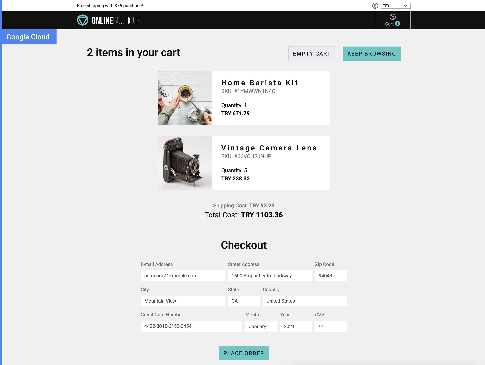

Demo: Build, deploy and run a microservices-based online boutique application using Pulumi, Helm, and Istio.

# The Application:

**Online Boutique** is a cloud-native microservices demo application.
Online Boutique consists of a 11-tier microservices application. The application is a
web-based e-commerce app where users can browse items,
add them to the cart, and purchase them.

The Demo Application source code is provided by the Google Cloud team, and I will use it to demonstrate technologies like
Kubernetes and Istio.

## Screenshots

| Home Page                                                                                                         | Checkout Screen                                                                                                    |
| ----------------------------------------------------------------------------------------------------------------- | ------------------------------------------------------------------------------------------------------------------ |
|  |  |

## Service Architecture

**Online Boutique** is composed of many microservices written in different
languages that talk to each other over gRPC.

